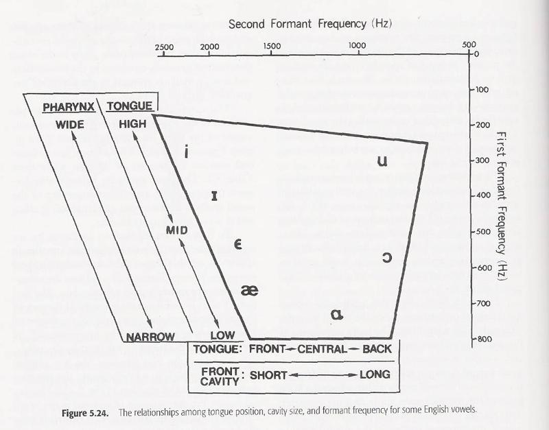

# Notes

## Acoustic properties of an audio recording
- duration [s]
- register (gender): low (adult male) / medium (adult female) / high (child)
- pace [vowels/sec]?

## Acoustic properties of a feature (not phoneme, which is distinguished by multiple features)
- vowel/consonant
- voicing/aspiration
- formant frequencies: F1 > pharyngeal cavity, F2 > front cavity, [Hz]
  - F3 > vocal folds, but not needed for distinguishing between vowels
- start time [s]
- end time [s]
- length/duration [s]

## Acoustic properties of a time slice of audio
- [x] silence: True / False
- [x] vocalization: True / False
- [ ] primary frequencies: F1, F2 [Hz] (consider F3)

# General research

http://www.linguisticsnetwork.com/the-basics-about-acoustic-phonetics/
>The majority of human sounds falls between 250-4000 Hz
>
>Formants are the the crest, or spectral peaks of a sound wave. Formants occur at around 1,000 Hz and correspond to a measurement of resonance produced in the vocal tract during phonation. The formant with the lowest frequency is referred to as the F1, the second F2, the third F3, etc.

## The Acoustic Properties of Vowels

https://my.ilstu.edu/~jsawyer/consonantsvowels3/consonantsvowels23.html

The distance between the [vertical] lines [on a spectrogram] for adult males represent approximately 1/100th of a second, and for adult females, 1/200th of a second.

https://my.ilstu.edu/~jsawyer/consonantsvowels3/consonantsvowels24.html

### Formants of /i/, /a/, and /u/

Formant | i | a | u
-- | --: | --: | --:
F1 | 300 | 800 | 300
F2 | 2500 | 1000 | 900
F3 | 3010 | 2500 | 2500

F1 is the lowest of all the vowels for the sound /i/. The constriction at the point of maximum pressure tends to raise F2 and F3. As you know, a neutrally shaped male adult vocal tract would have resonant frequencies of 500, 1,500, and 2,500 Hz. We can see that when /i/ is produced, F1 = 270 Hz, F2= 2290 Hz, and F3 = 3010 Hz.

### Vowel Quadrilateral

## Properties of speech sound features

http://www.linguisticsnetwork.com/features/

### Consonants
For stops, fricatives, and affricates:
- voicing/aspiration
- place of articulation
- manner of articulation

For nasals, liquids, and glides:
- place of articulation
- manner of articulation
- Voicing is not mentioned since these phonemes are always voiced.

### Vowels
- height
- part of the tongue
- tense/lax (ATR/RTR)
- roundness
